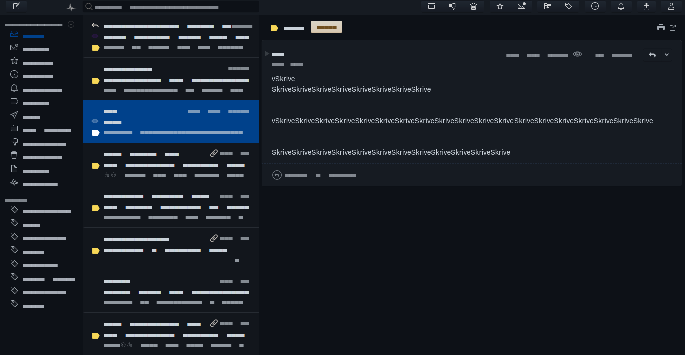

<h1 align="center">
  
Runeru Mailspring Theme
  
</h1>

<h3 align="center">
  <strong> A dark theme for <a href="https://getmailspring.com/">Mailspring</a></strong>  
</h3>

 • <a href="#install">Install</a> 

## Screenshot

## Install

#### Getting the theme

If you use git, you can get the theme by cloning this repo:

    $ git clone https://github.com/runeru/mailspring-runeru-theme.git

Or you can download the [.zip file](https://github.com/runeru/mailspring-runeru-theme/archive/refs/heads/master.zip)
and then extract it where you want it.

#### Activating theme

1. Open Mailspring and choose `Edit > Install Theme` 
2. Navigate to where you extracted/cloned the repo and select the `mailspring-runeru-theme-master` folder 
3. Click `Choose`
4. You will get a notice that a theme has been installed and activated!
5. If you want to change back to another theme, click `Edit > Change theme

